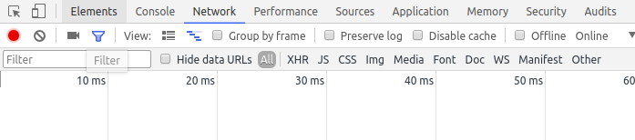
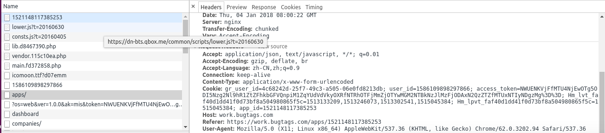
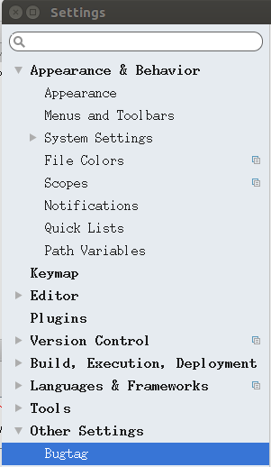
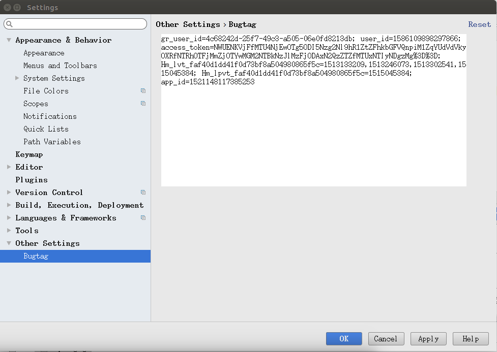
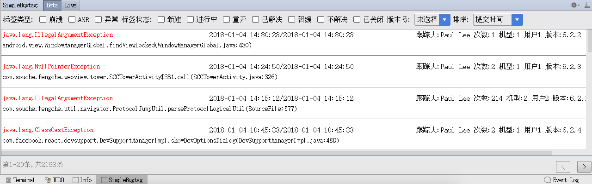
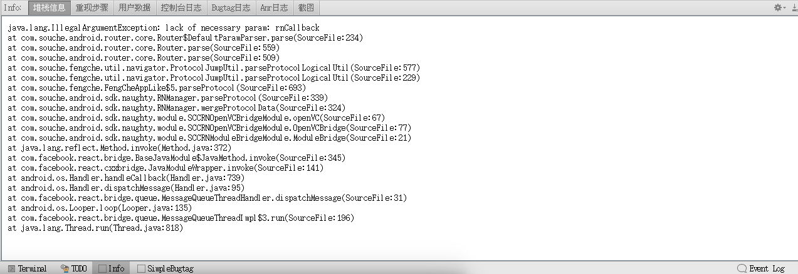
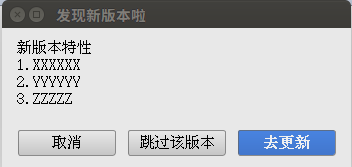

## BugTag插件设置说明
   1. 下载dist目录下面的jar包如(bugtag-0.0.1.jar)
   2. 获取你的Bugtag账号的cookie
   	  (1)在bugtag官网上登录你的账号
      (2)按F12打开开发者选项切换到Network tab
      
      (3)按F5刷新下网页
      (4)寻找请求头中包含cookie属性的请求
      
   3. 打开Android Studio 选中File下面的Setting 如下图所示
   
   4. 选择Bugtag选项如下图所示
   
   5. 在右侧输入你自己的Bugtag账号的cookie,点击确定
   
   6. 打开simpleBugtag tab
   

## BugTag插件使用说明
   1. 在simpleBugtag界面点击checkbox可以进行标签类型和标签状态的筛选,点击下拉列表可以进行排序
   2. 最上方的beta和live用于切换环境,beta代表测试环境,live代表线上环境
   3. 点击右下角的<>用于分页查看
   4. 双击item可以跳往Info tab,首次进入可以不会加载堆栈信息,左右滑动下tab就行
   5. info界面可以查看堆栈信息、重现步骤、用户数据、控制台日志、bugtag日志、Anr日志和截图其中控制台日志可以根据level进行筛选
   
   6. 在该界面点击右键会返回到Simplebugtag界面
  
## Bugtag更新说明
* 当服务器上含有新版本后,再次打开Android Studio会弹出更新dialog,点击取消关闭该dialog,下次启动后还会弹出,若点击忽略本版本,只有当服务器上的版本再次更新时才会再弹出dialog,点击去更新就直接打开浏览器下载jar包
   